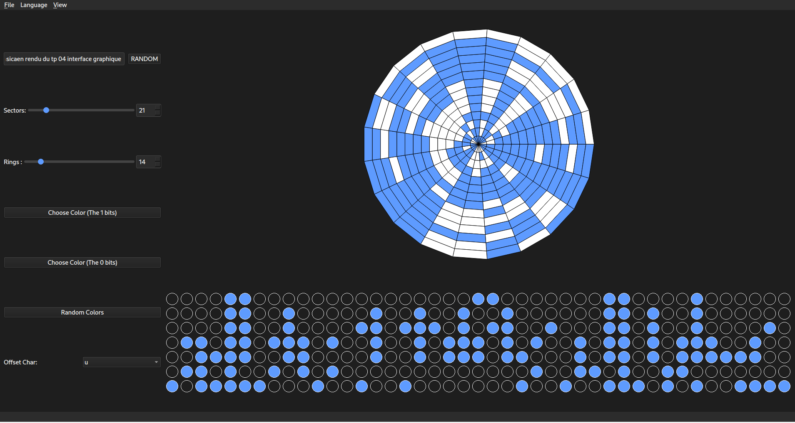

# Parachute Encoder

## Project Overview

**Parachute Encoder** is a graphical Qt application that encodes a text message into a "parachute" pattern — a circular visual representation using binary bits arranged in concentric tracks and radial sectors.

This project was developed as part of a graphical interface assignment, with added features to enhance usability, customization, and functionality.





---

# Implemented Features:

- The message is managed by a **model class**, offering access to individual bits (e.g., the *k*-th bit of the message).

- The **number of sectors and/or tracks** can be adjusted using a **slider and a spin box**.

- The application provides a **binary view** in addition to the **parachute view**.

- A standard **menu bar and actions** are available, including keyboard shortcuts:
  - `Alt+O` → Open a new parachute
  - `Ctrl+S` → Save the current parachute

- The application supports **language switching** (French or English).

- A **dark mode** can be toggled from the **View** menu.

- Metadata such as **user**, **date**, and **application version** are added to the saved file.

- The user can choose the **reference character** used for encoding (default is `'@'`).

- The user can select the **two colors** used to represent bits (1 and 0).

- A **random color mode** is available, especially for the **bits set to 1**.

- A **random generation mode** is available for:
  - The message content
  - The number of sectors
  - The number of tracks

- **Sectors must be chosen in multiples of 7** (e.g., 7, 14, 21, ...).

- **Robust error handling**:
  - If the user writes a message that **cannot be encoded** with the current parachute configuration (based on sectors and tracks), they will be **warned** accordingly.

### Configuration Storage (PF Format)

All parameters are saved in a `.pf` (**Parachute File**) format.  
The file is **encrypted** and can only be accessed on the **same machine**.

### Example decrypted content:
```ini
[Metadata]
Date=2025-03-24T18:56:12
Author=pentafreeerror
AppVersion=1.0

[Message]
ENSICAEN TEST

[Parameters]
Sectors=28
Tracks=5
Language=fr
bit1_color=#45afab
bit0_color=#bf0d83
offsetChar=W
backGround=#1e1e1e
```


---

## Building and Running the Project

### Prerequisites

Ensure you have the following installed:

- **Qt 5**
- **CMake**

### Build Instructions

```bash
chmod +x build.sh
./build.sh
```

### Run

```bash
./build/tp04
```

> If your binary name is different, adjust accordingly.

---

## License

This project is licensed under the **MIT License**.

---

## Author

**Kalash Abdulaziz**
<abdulaziz.kalash@ecole.ensicaen.fr>

---
